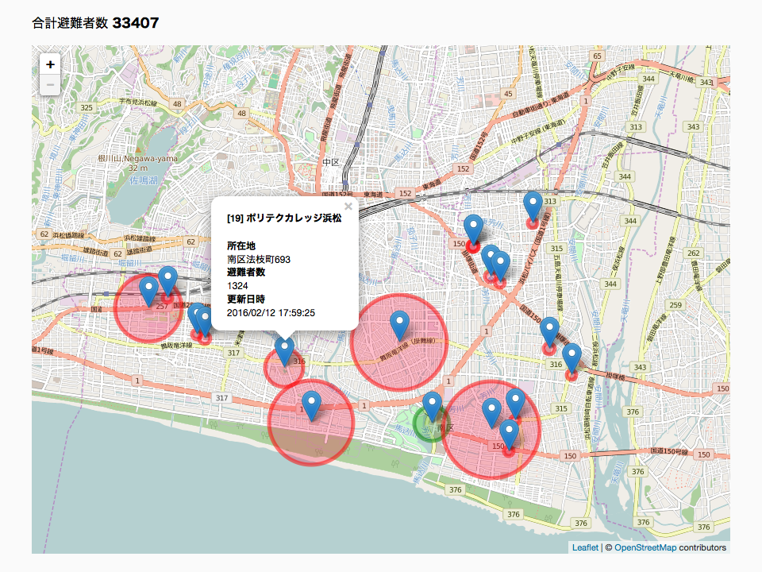

# 避難所マップ 試作版
避難所を地図に表示するプログラムの試作版です。OpenStreetMap の地図データを使い、その上に避難者数等の情報を表示します。

現時点ではインターネットに接続する必要があります。地図データをダウンロードできたら、インターネットに接続していなくても使えるようになります。

# 使用ライブラリ
* [Leaflet](http://leafletjs.com/)
